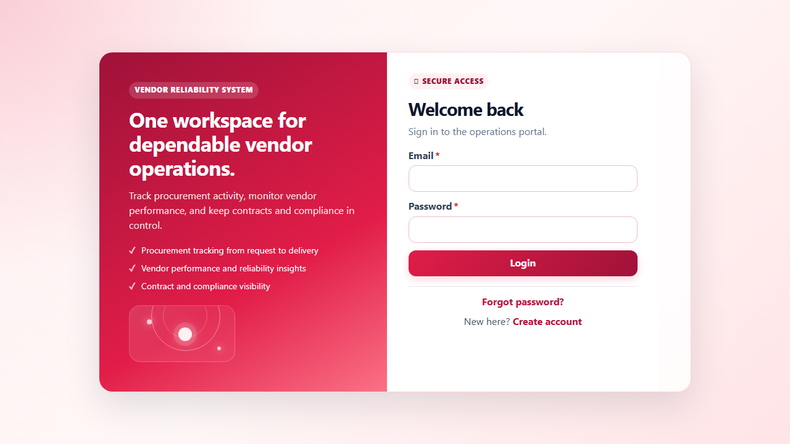
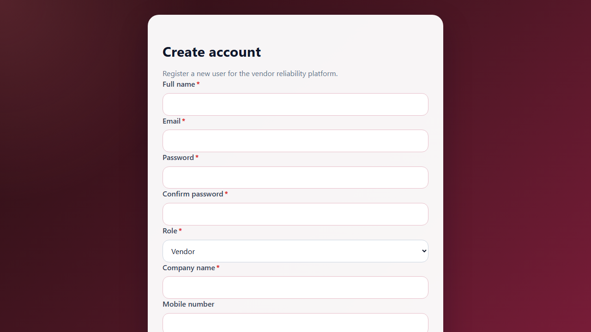
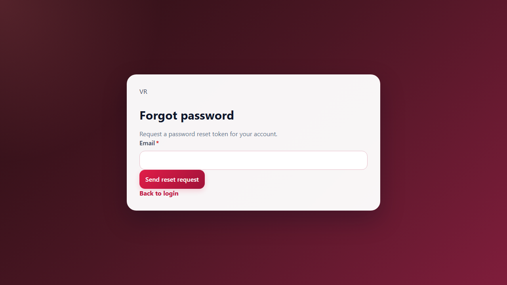
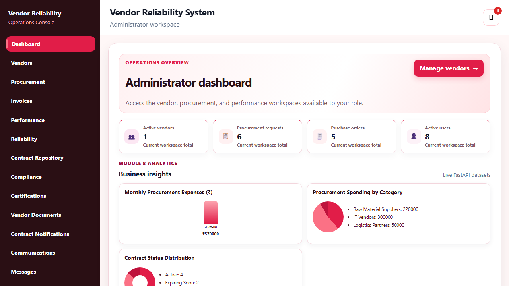
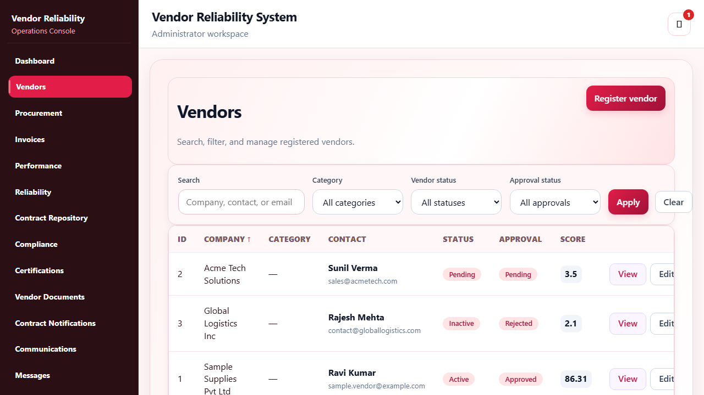
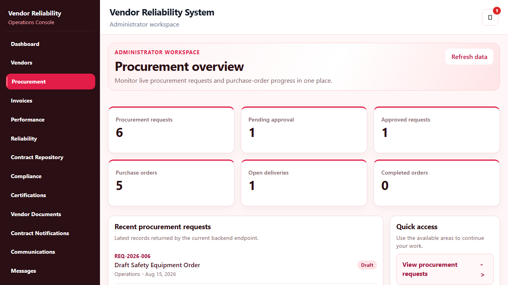
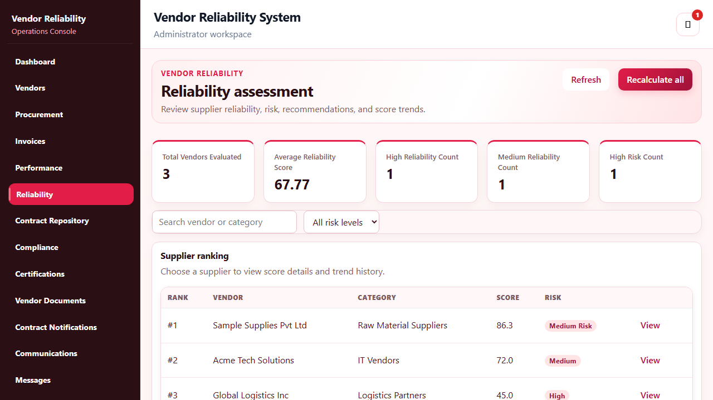

<div align="center">

# 🏢 Vendor Reliability Intelligence Platform

### ✨ Smarter vendor decisions. Seamless procurement. Trusted partnerships.

[](https://angular.dev/)
[](https://fastapi.tiangolo.com/)
[](https://www.postgresql.org/)
[](https://www.docker.com/)
[](#)
[](http://13.232.16.153)

</div>

> An enterprise web application that manages the complete vendor lifecycle: secure onboarding, procurement, vendor performance, reliability intelligence, compliance, communication, notifications, dashboards, and reports.

<div align="center">
  <a href="http://13.232.16.153"><strong>Explore the live application</strong></a>
</div>

## 💡 Why this platform?

Organizations work with many vendors, but deciding who to trust should not depend on guesswork. This platform connects procurement activity with delivery results, quality feedback, communication records, contracts, and compliance data to produce useful vendor reliability insights.

| Phase | Connected workflow |
| :---: | --- |
| **01** | 🤝 **Vendor Registration**  →  ✅ **Approval and Compliance** |
| **02** | 🛒 **Procurement Request**  →  📦 **Purchase Order**  →  🚚 **Delivery and Invoice** |
| **03** | 📈 **Performance Evaluation**  →  ⭐ **Reliability Score** |
| **04** | 💡 **Recommendations**  →  📑 **Business Reports** |

## 🖼️ Product gallery

| Secure access | Vendor registration |
| :---: | :---: |
|  |  |
| `login.png` | `registration.png` |

| Password recovery |
| :---: |
|  |
| `forgot-password.png` |

### Product workspace

| Administrator dashboard | Vendor management |
| :---: | :---: |
|  |  |
| Live operations overview | Vendor list, filters, statuses, and actions |

| Procurement management | Reliability intelligence |
| :---: | :---: |
|  |  |
| Procurement requests and workflow | Rankings, risk levels, and reliability scores |


## 🧩 Modules at a glance

| # | Module | Highlights |
| :---: | --- | --- |
| 01 | 🔐 Authentication & Roles | Registration, login, JWT security, password reset, profiles, guards, and role-aware access. |
| 02 | 🤝 Vendor Management | Vendor CRUD, categories, contacts, documents, approvals, and status tracking. |
| 03 | 🛒 Procurement Management | Requests, approvals, vendor assignment, purchase orders, tracking, invoices, payments, and status history. |
| 04 | 📈 Vendor Performance | Delivery monitoring, quality checks, response tracking, service ratings, metrics, history, and rankings. |
| 05 | ⭐ Vendor Reliability | Automatic reliability scores, risk levels, trends, supplier ranking, and recommendations. |
| 06 | 📄 Contract & Compliance | Contracts, renewals, certifications, compliance checks, expiry reminders, and documents. |
| 07 | 💬 Communication | Direct messages, procurement discussions, files, conversation history, and activity logs. |
| 08 | 📊 Dashboard & Analytics | Role-aware dashboards, visual analytics, procurement insights, and vendor summaries. |
| 09 | 🔔 Notifications | In-app notifications, priorities, read status, and scheduled delay/expiry alerts. |
| 10 | 📑 Reports & Export | Filterable business reports with PDF and Excel export. |

## 👥 Roles and access

| Role | Primary responsibilities |
| --- | --- |
| **Administrator** | Full application management, users, vendors, and reporting. |
| **Procurement Manager** | Approvals, vendor assignment, purchase orders, contracts, and performance reviews. |
| **Supply Chain Manager** | Delivery tracking, supply-chain visibility, and vendor reliability monitoring. |
| **Vendor** | Own profile, assigned orders, invoices, documents, and permitted performance information. |
| **Finance Officer** | Invoice verification, payments, purchase-order finance data, and financial reporting. |
| **Auditor** | Read-only visibility into contracts, compliance records, history, and reports. |

## 🛠️ Tech stack

| Layer | Technologies |
| --- | --- |
| Frontend | Angular 19, Angular Material, Bootstrap, Chart.js |
| Backend | FastAPI, Pydantic, SQLAlchemy, Alembic, Uvicorn |
| Database | PostgreSQL 16 |
| Security | JWT, password hashing, Angular guards, backend authorization |
| Documents & reports | Multipart uploads, ReportLab PDF export, OpenPyXL Excel export |
| DevOps | Docker, Docker Compose, environment-based configuration |

## 🏗️ Architecture

| Presentation layer | Application layer | Data and operations |
| :---: | :---: | :---: |
| 🎨 **Angular Frontend** | ⚡ **FastAPI Backend** | 🐘 **PostgreSQL** |
| Angular Material and Chart.js | JWT security and business services | SQLAlchemy and Alembic migrations |
|  | 📄 Documents, notifications, PDF, and Excel exports |  |

## 🚀 Run with Docker

### ✅ Prerequisites

- Git
- Docker Desktop with Docker Compose enabled

### ▶️ Start the platform

```bash
# 1. Create local environment configuration
copy .env.example .env

# 2. Build and start frontend, backend, and PostgreSQL
docker compose up --build
```

Then open:

| Service | URL |
| --- | --- |
| Web application | http://localhost:4200 |
| FastAPI Swagger API docs | http://localhost:8000/docs |
| FastAPI health check | http://localhost:8000/health |

The backend automatically applies Alembic database migrations when its container starts.

## 💻 Local development

### ⚙️ Backend

```bash
cd backend
python -m venv venv
venv\Scripts\activate
pip install -r requirements.txt
alembic upgrade head
uvicorn app.main:app --reload
```

### 🎨 Frontend

```bash
cd temp-frontend
npm ci
npm start
```

Configure a running PostgreSQL database through `DATABASE_URL` in the root `.env` file before starting the backend.

## 🔒 Environment variables

Never commit real passwords, JWT secrets, email credentials, or API keys.

| Variable | Description |
| --- | --- |
| `POSTGRES_DB`, `POSTGRES_USER`, `POSTGRES_PASSWORD` | PostgreSQL configuration |
| `DATABASE_URL` | Backend database connection URL |
| `SECRET_KEY` | JWT signing key; set a strong unique value for production |
| `BACKEND_PORT`, `FRONTEND_PORT` | Docker published ports |
| `NOTIFICATION_SCHEDULER_ENABLED` | Enable expiry and delayed-delivery scans |
| `NOTIFICATION_SCHEDULER_INTERVAL_MINUTES` | Notification scan frequency |

Start from [.env.example](.env.example). See [DOCKER.md](DOCKER.md) for Docker-specific notes.

## 🧪 Tests

The backend test suite covers authentication, authorization, vendors, procurement, purchase orders, invoices, performance, reliability, contracts, communications, notifications, dashboards, documents, and reports.

```bash
cd backend
pytest
```

## 📁 Project structure

```text
Vendor---Team-5/
|-- backend/
|   |-- app/
|   |   |-- api/          # FastAPI routes
|   |   |-- models/       # SQLAlchemy database models
|   |   |-- schemas/      # Pydantic request and response schemas
|   |   `-- services/     # Business logic and calculations
|   |-- alembic/          # Database migrations
|   `-- tests/            # Automated backend tests
|-- temp-frontend/
|   `-- src/app/          # Angular features, services, guards, and UI
|-- docs/screenshots/     # README screenshots
|-- docker-compose.yml
`-- .env.example
```

## ☁️ Deployment readiness

The project is containerized for Docker Compose and ready to be deployed to an AWS EC2 server after production environment variables and security-group rules are configured. Validate login, authorization, vendor operations, procurement, and database connectivity locally before deployment.

---

<div align="center">
  Vendor Reliability Intelligence Platform - one workspace for smarter procurement decisions.
</div>
